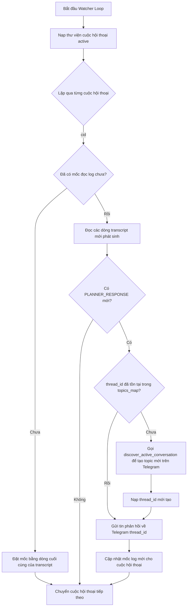

# CODEMAP: TELEGRAM ANTIGRAVITY BRIDGE

Bản đồ cấu trúc mã nguồn của tệp `telegram_antigravity_bridge.py` mô tả các biến toàn cục, cấu trúc hàm và luồng tương tác.

---

## 1. Các Biến Toàn Cục Chính (Global Variables)

*   `active_ls_address`: Địa chỉ Language Server (mặc định: `localhost:55210`).
*   `active_csrf_token`: Token xác thực CSRF cho API Language Server.
*   `chat_id`: Telegram Chat ID nhận lệnh và gửi phản hồi (đọc từ cấu hình môi trường `.env`).
*   `topics_map`: Bản đồ lưu trữ liên kết giữa `conversation_id` và `thread_id` (được đọc/ghi vào `topics_map.json`).
*   `conversation_last_steps`: Bộ nhớ tạm lưu trữ mốc index cuối cùng (`step_index`) của từng cuộc hội thoại để watcher so sánh và phát hiện tin nhắn mới.
*   `CONVERSATION_ID`: ID của cuộc hội thoại mặc định hiện hành đang hoạt động.

---

## 2. Bản đồ Cấu trúc Hàm (Function Map)

### A. Khởi tạo & Cấu hình (Initialization & Settings)
*   `load_env()`: Nạp các biến môi trường từ tệp `.env`.
*   `load_topics_map()`: Đọc tệp cấu hình liên kết topic `topics_map.json`.
*   `save_topics_map()`: Ghi đè cấu hình liên kết topic hiện tại xuống đĩa.
*   `load_conversation_library()`: Quét và tải toàn bộ các cuộc hội thoại hợp lệ (không phải sub-agent, hoạt động trong 3 ngày qua) từ thư mục `brain`.

### B. Tự động Kết nối & Phân quyền (Auto-Discovery & Authorization)
*   `is_port_open(host, port)`: Kiểm tra trạng thái mở của cổng mạng.
*   `discover_active_daemon()`: WMI quét CommandLine hệ điều hành để tự động bắt cổng mạng và token của Language Server.
*   `extract_project_id_from_db(conversation_id)`: Đọc blob nhị phân từ bảng `trajectory_metadata_blob` trong tệp SQLite DB của cuộc hội thoại để trích xuất mã Project ID đích thực tế.
*   `discover_daemon_for_project(project_path)`: Dò tìm chính xác cổng HTTP và CSRF Token của dự án tương ứng thông qua đối chiếu CommandLine/Log của các tiến trình daemon đang hoạt động.

### C. Quản lý Topic Telegram (Telegram Forum Topic Management)
*   `create_telegram_forum_topic(chat_id, name)`: Tạo topic mới trên Telegram và trả về `thread_id` (hoặc `0` làm fallback).
*   `edit_telegram_forum_topic(chat_id, thread_id, new_name)`: Đổi tên topic khi tiêu đề cuộc hội thoại thay đổi.
*   `discover_active_conversation(target_cid=None, target_topic=None)`: Đăng ký, tạo và đồng bộ hóa topic mới theo yêu cầu (On-demand) cho 1 cuộc hội thoại cụ thể hoặc toàn bộ thư viện.
*   `detect_project_cwd(conversation_id)`: Quét transcript để dò tìm thư mục dự án tương ứng làm CWD cho CLI.

### D. Điều phối & Chuyển tiếp Tin nhắn (Message Router)
*   `push_message_to_agent(message_text, conversation_id)`: Gửi yêu cầu HTTP POST đẩy tin nhắn từ Telegram vào Agent của cuộc hội thoại tương ứng.
*   `switch_conversation_context(new_id, silent=False)`: Chuyển đổi bối cảnh cuộc hội thoại đang giám sát trên IDE.
*   `send_split_message_to_thread(chat_id, thread_id, text, parse_mode, limit)`: Chia nhỏ tin nhắn dài hơn 2000 ký tự và gửi liên tiếp vào topic Telegram.

### E. Giám sát Nhật ký & Xuất bản (Log Watcher & Publishing)
*   `is_subagent_conversation(first_message_content)`: Nhận diện cuộc hội thoại của Sub-Agent tự động.
*   `clean_markdown_for_telegram(text)`: Làm sạch cấu trúc Markdown để tương thích với trình render của Telegram.
*   `publish_to_telegraph(title, markdown_content)`: Chuyển đổi Markdown sang HTML DOM nodes và gọi Telegraph API để tạo trang Instant View.
*   `watch_transcript_loop()`: Vòng lặp chạy ngầm giám sát tệp nhật ký `transcript.jsonl` của toàn bộ các phiên chat trong thư viện để gửi tin phản hồi của Agent về Telegram theo thời gian thực (hỗ trợ On-demand tạo topic).

### F. Long Polling & CLI Command (Telegram Bot Daemon)
*   `handle_telegram_command(text, sender_chat_id, thread_id)`: Phân tích cú pháp và xử lý các lệnh điều khiển bot (`/help`, `/list`, `/switch`, `/log`, `/autoswitch`).
*   `run_telegram_bot()`: Vòng lặp Long Polling nhận tin nhắn từ Telegram và chuyển tiếp tới Agent.

---

## 3. Sơ đồ Luồng Hoạt Động Watcher On-Demand (On-Demand Flowchart)

