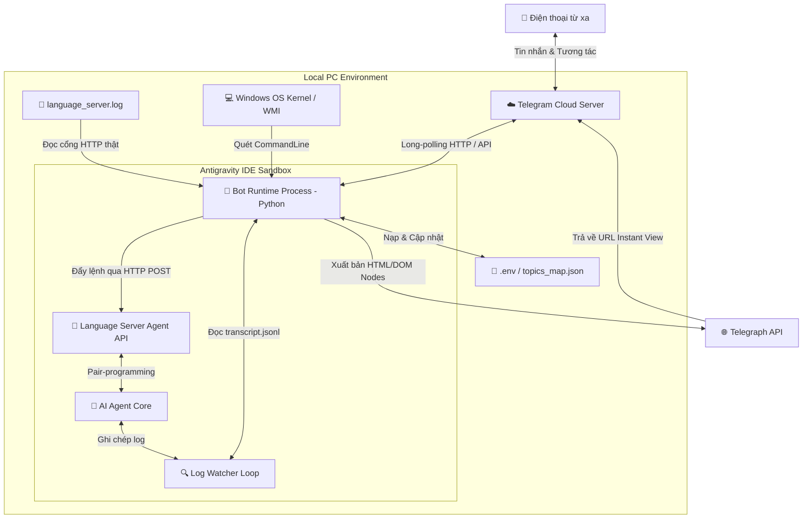

# Antigravity Telegram Bridge

Bộ điều khiển dynamic pair-programming AI Agent (Antigravity) từ xa thông qua ứng dụng Telegram Group Topics với các cơ chế tự động kết nối thông minh và xuất bản tài liệu tĩnh qua Telegra.ph.

---

## 🚀 Tính năng nổi bật

1. **Auto-Discovery (Tự động kết nối):** Bot tự động quét cổng mạng và mã CSRF token của Language Server đang hoạt động trên máy tính mà không cần bất kỳ cấu hình cổng tĩnh hay thao tác mồi từ IDE.
2. **On-Demand Forum Topics (Chống tràn Topic):** Không tự động tạo topic hàng loạt lúc khởi động. Bot chỉ tự động tạo topic riêng cho các cuộc trò chuyện sạch khi phát hiện có hoạt động phát sinh thực tế kể từ lúc khởi chạy, quản lý không giới hạn số lượng hội thoại mà không sợ tràn giới hạn Telegram.
3. **Làm sạch & Đổi tên Topic động:** Tự động loại bỏ các thẻ XML hệ thống rác ở tin nhắn đầu tiên, và đổi tên Topic Telegram theo tiêu đề H1 trong các tài liệu Spec/Plan thực tế.
4. **Khử nhiễu Sub-Agent:** Tích hợp bộ lọc tự động nhận diện và chặn hoàn toàn việc spam tạo topic từ các luồng Sub-Agent chạy song song kiểm định hoặc sửa lỗi tự động.
5. **Telegraph Publishing:** Tự động xuất bản các tài liệu Spec/Plan/Walkthrough dài hơn 1500 ký tự lên Telegra.ph để đọc dưới dạng Instant View sạch đẹp trên điện thoại di động.
6. **Tương thích Chat cá nhân 1-1:** Tương thích và chuyển tiếp mượt mà cho các tài khoản Telegram Business có chia topic trực tiếp trên cuộc trò chuyện cá nhân.

---

## 🏗️ Kiến trúc thiết kế & Luồng dữ liệu (Architecture & Data Flow)

Hệ thống được thiết kế theo mô hình kiến trúc hướng sự kiện (Event-Driven) kết hợp quét nhật ký (Log-Polling Reader) để đảm bảo độ độc lập tối đa với giao diện đồ họa (UI) của IDE:



### Luồng xử lý chi tiết (Data Flow Steps):
1. **Khởi động (Bootstrapping):** Bot nạp cấu hình từ `.env`. Sử dụng lệnh WMI quét tiến trình Windows để tìm `language_server.exe` lấy CSRF Token bảo mật. Đồng thời đọc ngược tệp `language_server.log` để lấy cổng HTTP ngẫu nhiên mà Language Server đang lắng nghe.
2. **Nhận lệnh từ xa (Inbound Flow):** Khi người dùng nhắn tin trong một Forum Topic cụ thể trên Telegram:
   * Bot bắt được tin nhắn và xác định `thread_id`.
   * Đối sánh `thread_id` trong `topics_map.json` để tìm `conversation_id` (ID hội thoại tương ứng).
   * Gửi yêu cầu HTTP POST đẩy tin nhắn đó vào đúng phiên chat của Agent thông qua cổng Language Server vừa phát hiện.
3. **Phản hồi từ Agent (Outbound Flow):** 
   * Tiến trình `Log Watcher Loop` của bot quét liên tục file nhật ký `transcript.jsonl` của hội thoại.
   * Khi phát hiện phản hồi mới từ Agent (`MODEL` / `PLANNER_RESPONSE`):
     * **Nếu tin nhắn ngắn (<1500 ký tự):** Bot gửi trực tiếp văn bản đã làm sạch Markdown về đúng Forum Topic tương ứng.
     * **Nếu tin nhắn dài (>1500 ký tự hoặc là tài liệu Spec/Plan):** Bot parse Markdown sang DOM Nodes và gọi Telegraph API để tạo trang Instant View tĩnh. Sau đó gửi tin nhắn tóm tắt kèm link đọc nhanh về Telegram.

---

## ⚠️ Hạn chế & Nhược điểm (Limitations & Drawbacks)

Mặc dù có độ ổn định rất cao và trải nghiệm người dùng vượt trội, hệ thống hiện hành vẫn tồn tại một số hạn chế kỹ thuật:

1. **Phụ thuộc vào hệ điều hành Windows (OS Windows Dependency):**
   * *Mô tả:* Cơ chế tự động phát hiện kết nối (Auto-Discovery) dựa trên việc gọi công cụ PowerShell `Get-CimInstance Win32_Process` của Windows để đọc CommandLine của tiến trình.
   * *Ảnh hưởng:* Hiện tại bot chưa hỗ trợ tự động quét tiến trình trên macOS và Linux (ở các hệ điều hành này, bot sẽ tự động fallback về việc đọc file daemon JSON tĩnh, yêu cầu đường dẫn thư mục daemon phải cấu hình đúng).
2. **Độ trễ quét nhật ký (Polling Latency):**
   * *Mô tả:* Do Language Server gốc của Antigravity không mở cổng WebSockets callback trực tiếp cho các ứng dụng bên ngoài, bot phải sử dụng vòng lặp quét log tuần tự (`watch_transcript_loop` chu kỳ quét 1 giây/lần).
   * *Ảnh hưởng:* Phản hồi từ Agent về Telegram sẽ có độ trễ khoảng từ 0.5s đến 1.5s sau khi Agent hoàn thành tác vụ trên IDE.
3. **Hạn chế duyệt quyền tương tác trực tiếp (UAC Modal Block):**
   * *Mô tả:* Khi không bật chế độ Away From Home (AFH Mode) mà chạy ở chế độ thường, nếu Agent yêu cầu duyệt quyền (ghi file hệ thống, chạy lệnh shell nhạy cảm), IDE sẽ hiện hộp thoại cảnh báo bảo mật của VS Code.
   * *Ảnh hưởng:* Do API gRPC của Language Server không công khai phương thức duyệt quyền từ xa, bot không thể click duyệt hộ anh từ xa (phải giải quyết bằng cách bật `AFH_MODE=ON` để kích hoạt cơ chế Ủy quyền thực thi qua file JSON bypass sandbox).
4. **Quyền hạn truy cập tệp log (File Access Permissions):**
   * *Mô tả:* Bot cần quyền đọc tệp `language_server.log` trong thư mục AppData Roaming của User.
   * *Ảnh hưởng:* Nếu tệp log này bị khóa bởi quyền hệ thống (hoặc antivirus chặn truy cập file AppData), bot sẽ không tự động phát hiện được cổng HTTP (cần chạy bot dưới quyền User sở hữu tiến trình).

---

## 🛠️ Cài đặt & Vận hành

### 1. Cấu hình môi trường (`.env`)
Hãy mở file `.env` và điền đầy đủ các thông tin:

* `TELEGRAM_BOT_TOKEN`: Token của bot Telegram lấy từ `@BotFather`.
* `TELEGRAM_CHAT_ID`: ID của chat nhóm/kênh Telegram của bạn.
* `TELEGRAPH_TOKEN`: Token tài khoản Telegra.ph (để trống bot sẽ tự động đăng ký và ghi đè vào file).
* `AFH_MODE`: Bật (`ON`) hoặc Tắt (`OFF`) chế độ Away From Home.
* `INTERVAL_MODE`: Tần suất quét bot (`FAST` ~ 30 giây, `MEDIUM` ~ 5 phút, `SLOW` ~ 15 phút).

### 2. Khởi chạy Bot
Chạy bot trực tiếp từ PowerShell hoặc Command Prompt của Windows:
```cmd
python C:\commandcenter\02_AI_Hub\antigravity-telegram-bridge\telegram_antigravity_bridge.py
```
Bot sẽ tự khởi chạy, đăng ký tài khoản Telegra.ph nếu chưa có, quét tìm tiến trình Language Server đang chạy và bắt đầu theo dõi tin nhắn.
